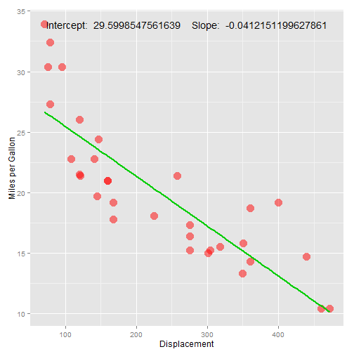

<style>
.title-slide {
  background-color: #66AAFF; /* #EDE0CF; ; #CA9F9D*/
}

</style>

## Overview

The application on www.shinyapps.io will automatically generate scatter plots to show the
dependency of MPG on the selected attributes in the `mtcars` dataset of the `datasets`
library in R.

1. Interface Functions
2. Working with `ggplot2` in Shiny Apps
3. A plot example

--- .class #id 

## Functions


--- .class #id 

## Using `ggplot2` in a Shiny App
The app used `ggplot2` library in this shiny app. But the problem is that we cannot put a string variable that contains target attribute name in `aes` function of `ggplot`. We must generate a temporary data frame with fixed attribute name and use this temporary data frame to draw the ggplot.

The following shows the example codes that generate the temporary data frame:

```r
tempData <- cbind(mtcars[,input$att], mtcars[,"mpg"])
colnames(tempData) <- c("Attribute", "mpg")
tempData <- data.frame(tempData)
```
where the `input$att` is the string variable read from the front panel of the app. But we cannot put it directly in the `aes` function. The following shows the codes that call the ggplot function:

```r
p <- ggplot(tempData, aes(Attribute, mpg))
```

--- .class #id 

## An example plot
The following shows the plot generate by the code in `server.R`.


 

